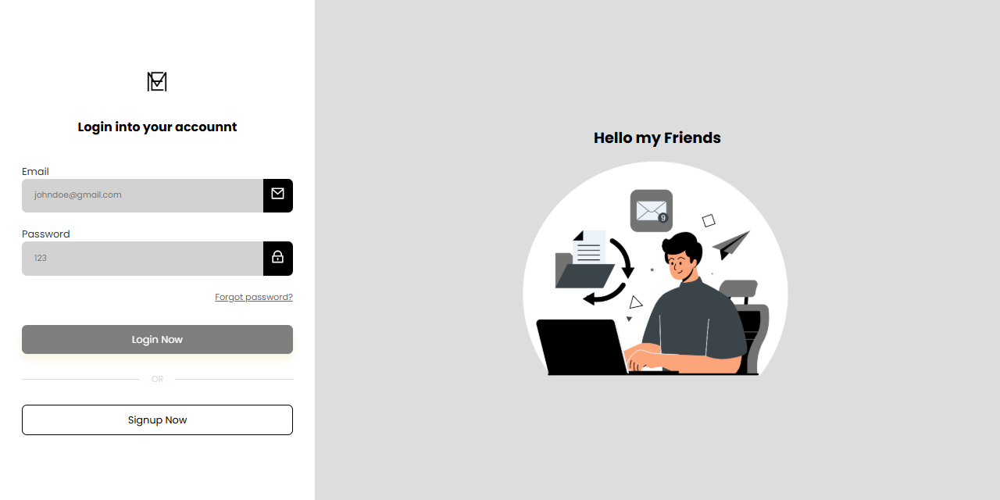

---

# 🛡️ Sistema de Login com Angular + Spring Security + JWT

Este projeto é uma aplicação full stack que implementa autenticação baseada em **JWT (JSON Web Token)** utilizando **Spring Boot** no backend e **Angular** no frontend.

---


## 🔧 Tecnologias Utilizadas

### Backend (Spring Boot)

* Java 
* Spring Boot
* Spring Security
* JWT 
* Spring Web
* Spring Data JPA
* H2 (banco de dados)

### Frontend (Angular)

* Angular Router
* Angular Forms
* HTTPClient

---

## 📌 Funcionalidades

### Backend

* Cadastro de usuário
* Autenticação com geração de JWT
* Proteção de rotas com Spring Security
* Refresh Token (opcional)

### Frontend

* Tela de login
* Tela de cadastro
* Tela protegida acessível apenas com token válido
* Armazenamento do JWT no localStorage
* Interceptador HTTP para envio automático do token

---

## ▶️ Como executar o projeto

### Backend

```bash
cd backend
./mvnw spring-boot:run
```

A aplicação será executada em: `http://localhost:8080`

### Frontend

```bash
cd frontend
npm run start
```

A aplicação será executada em: `http://localhost:4200`


